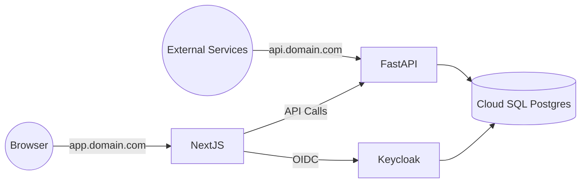
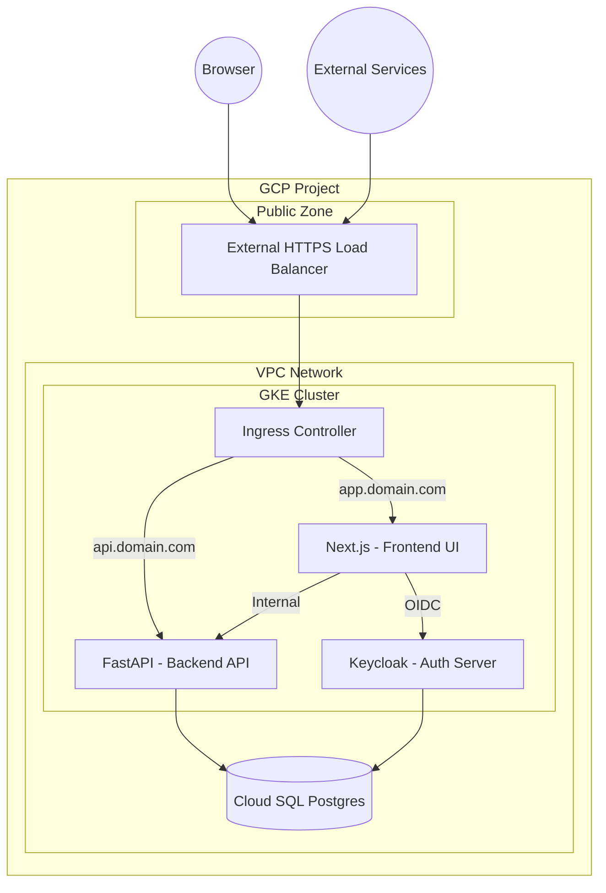

# Architecture

## Overview

This setup runs **Next.js**, **Keycloak**, and **FastAPI** inside **GKE**.
**FastAPI** is externally reachable for integrations (webhooks, data retrieval).
**Cloud SQL Postgres** uses private IP inside the VPC.

## High-Level Architecture

## Infrastructure Architecture (GCP View)

## Ingress Routing

| Host | Target Service | Purpose |
|------|----------------|---------|
| `app.domain.com` | Next.js | Frontend UI |
| `api.domain.com` | FastAPI | External API |

## Networking Notes

- Next.js, Keycloak, FastAPI run as pods in GKE.
- Pod-to-pod traffic is internal (ClusterIP services).
- FastAPI supports both internal calls (from Next.js) and external calls (from integrations).
- Cloud SQL uses private IP (Private Service Connect).

## Recommendation

- **Browser → API:** Use **BFF** if security is highest priority (browser never sees JWT).
- **Browser → API (direct):** Use **httpOnly cookie** for good security + low latency.
- **External integrations:** Keep `api.domain.com` and use **API keys or service JWTs**.
