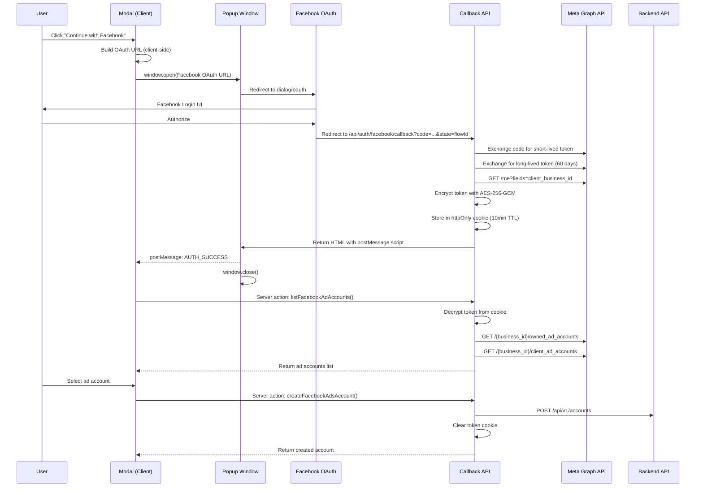

# Facebook Business Login Flow

Connect Meta Ads ad accounts using Facebook Login for Business with Business Integration System User tokens.

## Overview

This flow enables users to authorize access to their Meta Business ad accounts via a popup OAuth flow with postMessage communication back to the parent page.

**Token Type:** Business Integration System User access token (long-lived, 60 days)

## Architecture



## Security

### Token Encryption
- **Algorithm:** AES-256-GCM with SESSION_SECRET
- **Storage:** httpOnly cookie (JS cannot access)
- **TTL:** 10 minutes (short-lived for security)
- **Cleanup:** Cleared on save OR modal close

### CSRF Protection
- **flowId:** Random UUID generated per authorization attempt
- **Origin verification:** postMessage only accepted from same origin
- **appsecret_proof:** All Graph API calls signed with HMAC-SHA256

### What's Stored in Backend
```json
{
  "auth_data": {
    "provider": "facebook",
    "access_token": "EAA...",
    "client_business_id": "123456789",
    "fb_user_id": "...",
    "fb_user_name": "...",
    "ad_account_id": "123456789"
  },
  "config_data": {
    "currency": "USD",
    "timezone": "America/Los_Angeles",
    "business_name": "My Business"
  }
}
```

## File Structure

```
app/api/auth/facebook/
└── callback/route.ts    # Handles callback, exchanges tokens, stores encrypted cookie

features/facebook/
├── components/
│   ├── FacebookAuthorizeModal.tsx  # Modal UI, builds OAuth URL client-side
│   └── index.ts
├── server/
│   ├── actions.ts       # Server actions (listFacebookAdAccounts, createFacebookAdsAccount, clearFacebookToken)
│   ├── metaGraph.ts     # Graph API client with appsecret_proof
│   └── index.ts
└── index.ts
```

## Environment Variables

```bash
# Server-side (secrets - never expose)
FACEBOOK_APP_ID=your_app_id
FACEBOOK_APP_SECRET=your_app_secret
FACEBOOK_CONFIG_ID=your_business_login_config_id
FACEBOOK_GRAPH_API_VERSION=v24.0
SESSION_SECRET=your_session_secret  # For AES-256-GCM encryption

# Client-side (public - for OAuth URL building)
NEXT_PUBLIC_FACEBOOK_APP_ID=your_app_id
NEXT_PUBLIC_FACEBOOK_CONFIG_ID=your_business_login_config_id
NEXT_PUBLIC_FACEBOOK_API_VERSION=v24.0
```

## Facebook App Setup

1. Create a **Business type app** in [Meta App Dashboard](https://developers.facebook.com/apps)
2. Add **Facebook Login for Business** product
3. Go to **Configurations** → **Create configuration**
4. Select:
   - Token type: **Business Integration System User access token**
   - Assets: **Ad Accounts**
   - Permissions: `ads_management`, `ads_read`, `business_management`
5. Save and copy the **Configuration ID** → `FACEBOOK_CONFIG_ID`
6. Add redirect URI to **Valid OAuth Redirect URIs**:
   ```
   https://your-domain.com/api/auth/facebook/callback
   ```

## Usage

The flow is triggered when a user clicks a Facebook template in the Add Account panel:

```tsx
// AddAccountPanel.tsx detects Facebook templates by:
if (
  template.platform.toLowerCase() === "facebook" ||
  template.platform.toLowerCase() === "meta" ||
  template.system_name.toLowerCase().includes("facebook")
) {
  // Opens FacebookAuthorizeModal
}
```

## Modal States

| State | Description |
|-------|-------------|
| `idle` | Initial state, shows "Continue with Facebook" button |
| `authorizing` | Waiting for user to complete Facebook login in popup |
| `loading_accounts` | Fetching ad accounts from Graph API |
| `accounts_loaded` | Displaying selectable list of ad accounts |
| `saving` | Creating account in backend |
| `error` | Shows error message with retry option |

## Token Lifecycle

1. **Short-lived token** → Received from code exchange (~1 hour)
2. **Long-lived token** → Exchanged immediately (60 days)
3. **Encrypted cookie** → Stored for 10 minutes max
4. **Backend storage** → Permanent (for API calls)

## References

- [Facebook Login for Business](https://developers.facebook.com/docs/facebook-login/facebook-login-for-business/)
- [Business Integration System User Tokens](https://developers.facebook.com/docs/marketing-api/system-users/)
- [Long-lived Access Tokens](https://developers.facebook.com/docs/facebook-login/guides/access-tokens/get-long-lived/)
- [Secure Graph API Requests (appsecret_proof)](https://developers.facebook.com/docs/graph-api/guides/secure-requests/)
