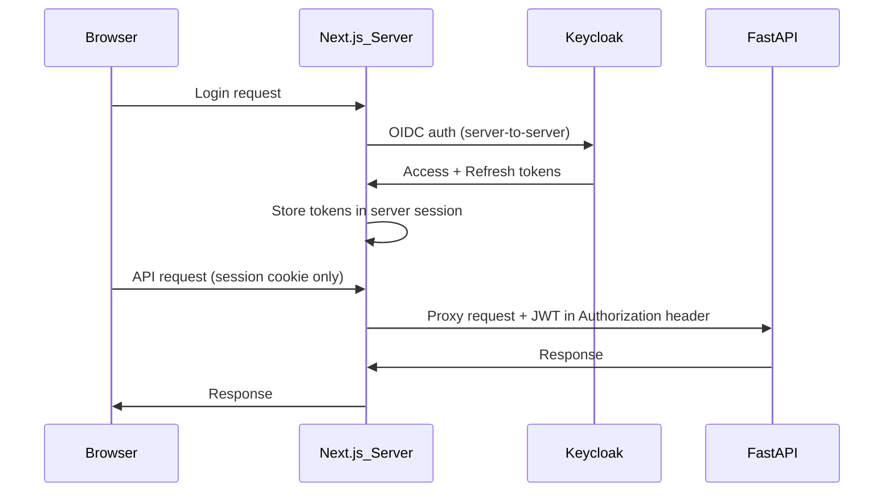
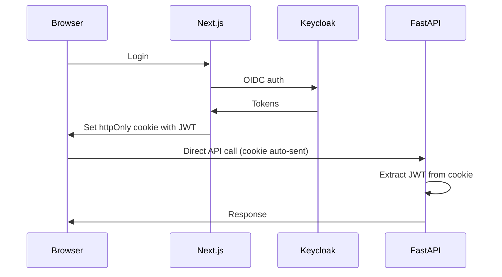
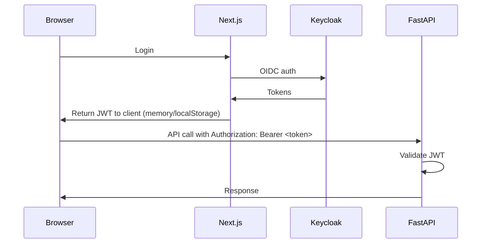

# Token Flow (Browser → API)

This covers how browser-initiated requests reach FastAPI. All patterns assume Keycloak issues JWTs.

## Pattern A: BFF (Backend-for-Frontend)



- Browser never sees JWT
- Tokens stored server-side (Redis/memory)
- Next.js API routes proxy to FastAPI
- Pros: Most secure, no token exposure
- Cons: Added latency, Next.js becomes bottleneck

## Pattern B: httpOnly Cookie



- Browser calls FastAPI directly
- JWT in httpOnly cookie (not accessible to JS)
- Requires CORS + CSRF protection
- Pros: Lower latency, direct calls
- Cons: Cookie size limits, CSRF handling needed

### Final config (recommended)

**Cookie**

```
Set-Cookie: jwt=<token>; Domain=.example.com; Path=/; HttpOnly; Secure; SameSite=None
```

**FastAPI CORS**

```
Allow-Origin: https://app.example.com
Allow-Credentials: true
```

**Browser fetch**

```js
fetch("https://api.example.com/...", { credentials: "include" })
```

**Notes**

- Works across `app.example.com` and `api.example.com` (same site).
- Does not work for `extern.test.com` (different registrable domain).

## Pattern C: Authorization Header (Direct)



- Browser stores JWT in memory/localStorage
- Sends via Authorization header
- Pros: Standard OAuth flow, stateless
- Cons: XSS risk if localStorage

## Comparison

| Pattern | Security | Latency | Complexity | Best For |
|---------|----------|---------|------------|----------|
| BFF | Highest | Higher | Medium | Sensitive data, compliance |
| httpOnly Cookie | High | Low | Medium | Standard web apps |
| Direct Header | Medium | Lowest | Low | SPAs, mobile-first |
