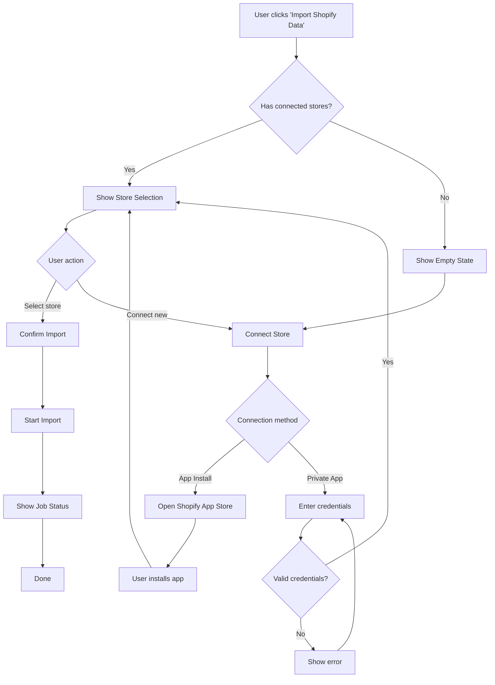
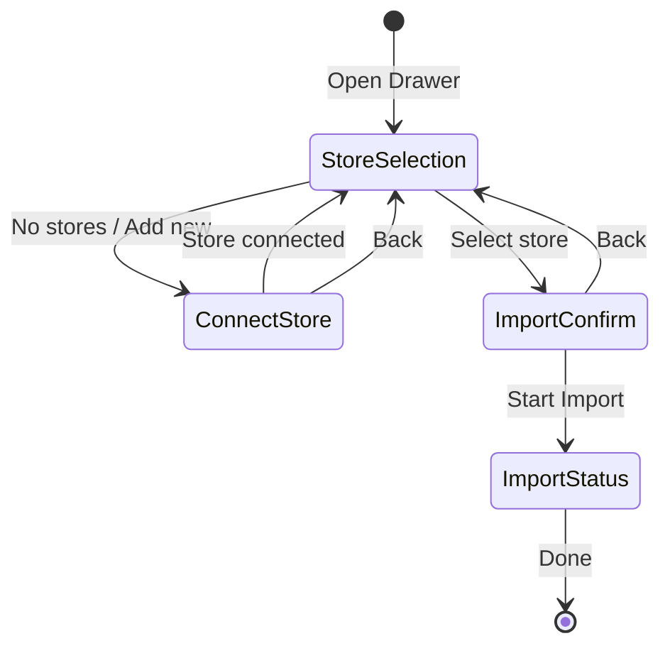
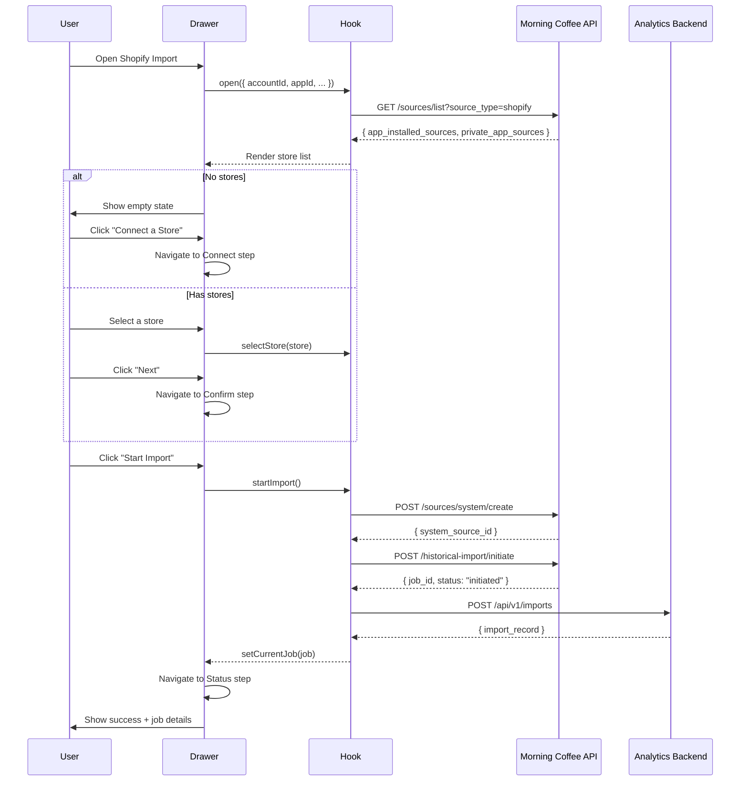
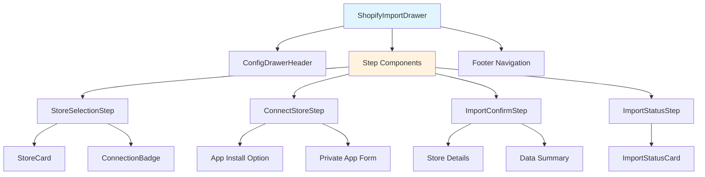
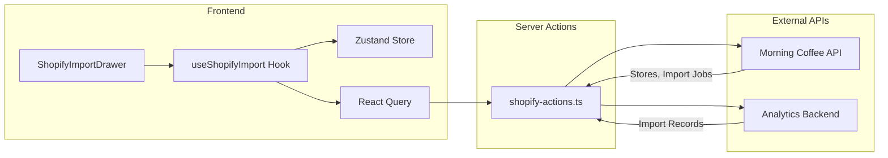
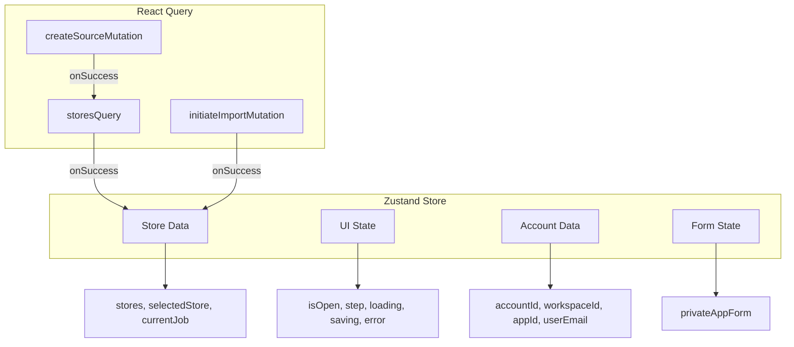
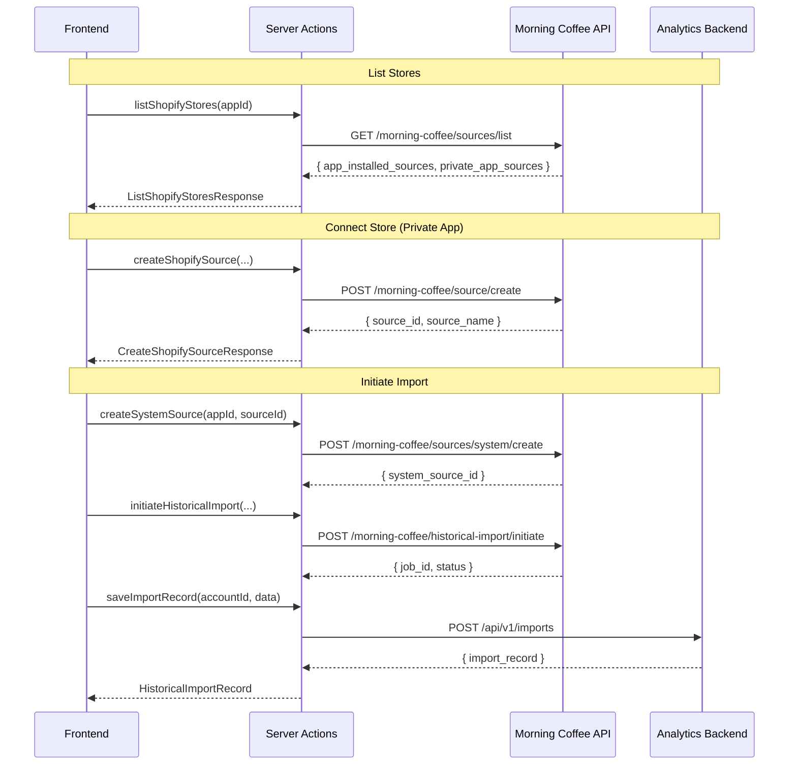
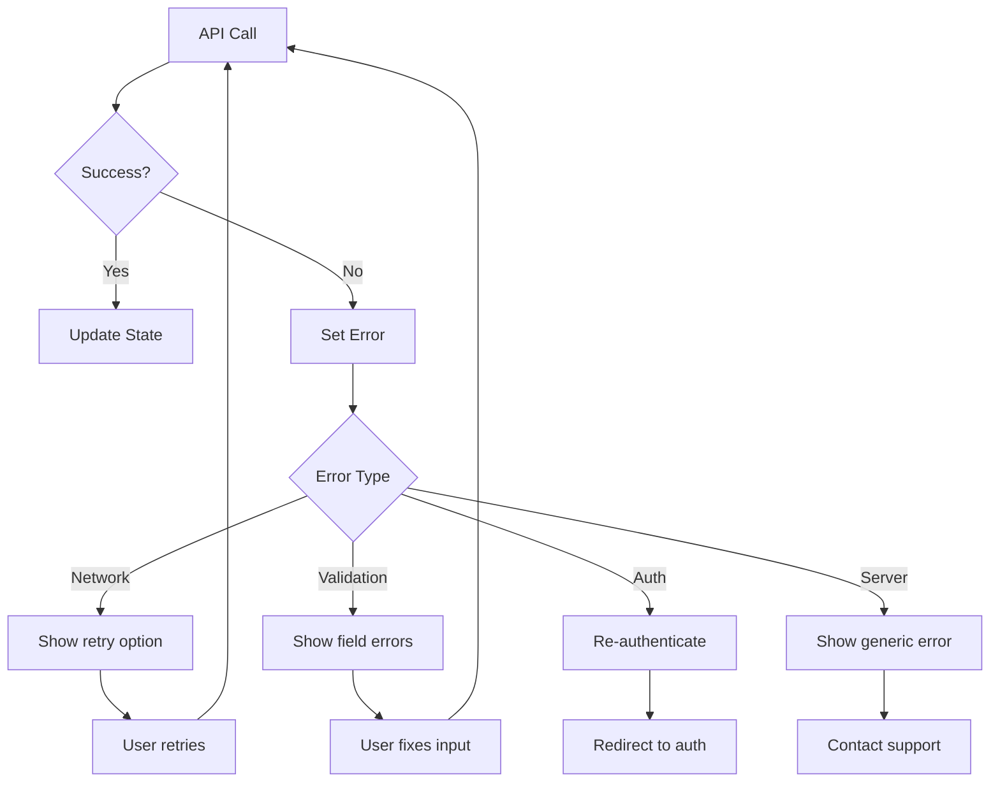

# Shopify Data Import

Import historical data from Shopify stores into the analytics platform.

## Table of Contents

- [Overview](#overview)
- [User Flow](#user-flow)
- [Architecture](#architecture)
- [Components](#components)
- [State Management](#state-management)
- [API Integration](#api-integration)
- [Usage](#usage)

---

## Overview

The Shopify Data Import feature allows users to:

1. View connected Shopify stores (grouped by connection method)
2. Connect new stores via App Install or Private App credentials
3. Select a store and initiate historical data import
4. Track import job status

### Store Connection Methods

| Method | Description | Recommended |
|--------|-------------|-------------|
| **App Install** | Install from Shopify App Store | Yes |
| **Private App** | Manual API credentials entry | No |

---

## User Flow

### High-Level Flow



### Step-by-Step Wizard Flow



### Detailed UI Flow



---

## Architecture

### Component Hierarchy



### Data Flow



### State Management



---

## Components

### ShopifyImportDrawer

Main drawer component that orchestrates the multi-step wizard.

```tsx
import { ShopifyImportDrawer } from "@/features/customerlabs";

// Render in your page/component
<ShopifyImportDrawer />
```

### Step Components

| Component | Step | Description |
|-----------|------|-------------|
| `StoreSelectionStep` | 1 | List and select connected stores |
| `ConnectStoreStep` | 2 | Connect new store (conditional) |
| `ImportConfirmStep` | 3 | Review import details |
| `ImportStatusStep` | 4 | Show job initiation status |

### Shared Components

| Component | Description |
|-----------|-------------|
| `StoreCard` | Selectable card displaying store info |
| `ConnectionBadge` | Badge showing connection method |
| `ImportStatusCard` | Card showing job status details |

---

## State Management

### Zustand Store Interface

```typescript
interface ShopifyImportState {
  // UI State
  isOpen: boolean;
  step: 1 | 2 | 3 | 4;
  loading: boolean;
  saving: boolean;
  error: string | null;

  // Account Data
  accountId: string | null;
  workspaceId: string | null;
  appId: string | null;
  userEmail: string | null;

  // Store Data
  stores: ShopifyStore[];
  selectedStore: ShopifyStore | null;
  currentJob: ImportJob | null;

  // Derived
  appInstalledStores: ShopifyStore[];
  privateAppStores: ShopifyStore[];

  // Actions
  open(params): void;
  close(): void;
  setStep(step): void;
  nextStep(): void;
  prevStep(): void;
  selectStore(store): void;
  // ... more actions
}
```

### Hook Usage

```typescript
import { useShopifyImport } from "@/features/customerlabs";

function MyComponent() {
  const {
    // State
    isOpen,
    step,
    stores,
    selectedStore,
    loading,
    saving,
    error,

    // Actions
    open,
    close,
    selectStore,
    startImport,
    connectStore,

    // Query state
    isLoadingStores,
    isConnecting,
    isInitiating,
  } = useShopifyImport();
}
```

---

## API Integration

### API Flow Diagram



### API Endpoints

#### Morning Coffee API (External)

| Endpoint | Method | Description |
|----------|--------|-------------|
| `/morning-coffee/sources/list` | GET | List connected Shopify stores |
| `/morning-coffee/source/create` | POST | Create new source (Private App) |
| `/morning-coffee/sources/system/create` | POST | Create system source for import |
| `/morning-coffee/historical-import/initiate` | POST | Start historical import job |

#### Analytics Backend (Internal)

| Endpoint | Method | Description |
|----------|--------|-------------|
| `/api/v1/imports` | POST | Save import record |
| `/api/v1/imports` | GET | Get import history |
| `/api/v1/imports/:id` | GET | Get single import record |

### Request/Response Examples

#### List Stores

```bash
GET /morning-coffee/sources/list?app_id=cl123&source_type=shopify
```

```json
{
  "success": true,
  "data": {
    "app_id": "cl123",
    "source_type": "shopify",
    "total_sources": 2,
    "app_installed_sources": [
      {
        "source_id": "shopify_001",
        "source_name": "My Store",
        "shopify_domain": "mystore.myshopify.com",
        "connection_method": "app_installed",
        "is_active": true
      }
    ],
    "private_app_sources": [
      {
        "source_id": "shopify_002",
        "source_name": "Legacy Store",
        "shopify_domain": "legacy.myshopify.com",
        "connection_method": "private_app",
        "is_active": true
      }
    ]
  }
}
```

#### Initiate Import

```bash
POST /morning-coffee/historical-import/initiate
```

```json
{
  "app_id": "cl123",
  "source_id": "shopify_001",
  "mc_dataset_id": "workspace123_cl123"
}
```

Response:

```json
{
  "success": true,
  "data": {
    "job_id": "job_abc123",
    "status": "initiated",
    "app_id": "cl123",
    "source_id": "shopify_001",
    "mc_dataset_id": "workspace123_cl123"
  }
}
```

---

## Usage

### Basic Usage

```tsx
import {
  ShopifyImportDrawer,
  useShopifyImport
} from "@/features/customerlabs";

function BackfillTab({ account, workspace }) {
  const { open } = useShopifyImport();

  const handleOpenImport = () => {
    open({
      accountId: account.id,
      workspaceId: workspace.id,
      appId: account.clabs_app_id,
      userEmail: user.email,
    });
  };

  return (
    <>
      <Button onClick={handleOpenImport}>
        <Store className="w-4 h-4 mr-2" />
        Import Shopify Data
      </Button>

      <ShopifyImportDrawer />
    </>
  );
}
```

### With Import History

```tsx
import { getImportHistory } from "@/features/customerlabs";

// In a server component or server action
const history = await getImportHistory(accountId, "shopify");

// Render import history
{history.map((record) => (
  <ImportHistoryRow key={record.id} record={record} />
))}
```

---

## File Structure

```
features/customerlabs/
├── components/
│   ├── tabs/
│   │   └── BackfillTab.tsx         # Entry point - integrates ShopifyImportDrawer
│   └── shopify/
│       ├── index.ts
│       ├── ShopifyImportDrawer.tsx
│       ├── shared/
│       │   ├── index.ts
│       │   ├── ConnectionBadge.tsx
│       │   ├── StoreCard.tsx
│       │   └── ImportStatusCard.tsx
│       └── steps/
│           ├── index.ts
│           ├── StoreSelectionStep.tsx
│           ├── ConnectStoreStep.tsx
│           ├── ImportConfirmStep.tsx
│           └── ImportStatusStep.tsx
├── hooks/
│   └── useShopifyImport.ts
├── services/
│   └── shopify-actions.ts          # Server actions (async functions only)
├── utils/
│   ├── index.ts
│   ├── shopify-helpers.ts          # Pure utility functions (client-safe)
│   └── shopify-mock-data.ts
├── types/
│   └── shopify.ts
└── docs/
    └── shopify-import.md

features/accounts/
└── hooks/
    └── useAccount.ts               # Fetches single account data for BackfillTab
```

---

## Database Schema

The `historical_imports` table stores import records (generalized for all source types):

```sql
CREATE TABLE historical_imports (
  id UUID PRIMARY KEY,
  account_id UUID NOT NULL,

  -- Source info
  source_type VARCHAR(50) NOT NULL,      -- 'shopify', 'bigcommerce', etc.
  source_id VARCHAR(255) NOT NULL,
  source_name VARCHAR(255) NOT NULL,
  source_domain VARCHAR(255),
  connection_method VARCHAR(50) NOT NULL,

  -- Job tracking
  job_id VARCHAR(255) NOT NULL UNIQUE,
  dataset_id VARCHAR(255) NOT NULL,
  status VARCHAR(50) NOT NULL DEFAULT 'initiated',
  error_message TEXT,

  -- Progress
  records_processed INTEGER,
  total_records INTEGER,

  -- Timestamps
  started_at TIMESTAMPTZ,
  completed_at TIMESTAMPTZ,
  created_at TIMESTAMPTZ DEFAULT NOW(),
  updated_at TIMESTAMPTZ DEFAULT NOW()
);
```

---

## Error Handling



### Error States

| Error | User Message | Action |
|-------|--------------|--------|
| Network failure | "Failed to load stores. Please try again." | Retry button |
| Invalid credentials | "Please enter a valid Shopify domain" | Fix input |
| Import failed | "Failed to initiate import" | Retry / Contact support |
| System source exists | (Silent) | Continue with existing |
